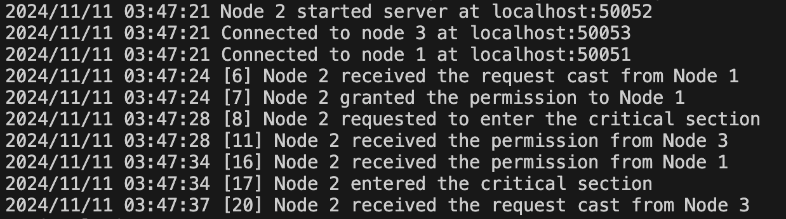

# Assignment 4

[Git repository with source codes](https://github.com/shiyue0101/MA4_DistributedMutualExclusion)

## Answers
### Question 1
**Describe how your system meets the System Requirements (R1, R2, and R3).**
   
- **R1: Implement a system with a set of peer nodes and a Critical Section that represents a sensitive system operation. Any node may request access to the Critical Section at any time. In this exercise, the Critical Section is emulated, for example, by a print statement or writing to a shared file on the network.**
  
  I implemented a system with three peer nodes. Each node can request access to a critical section at any time by calling the `RequestCriticalSection` function, with a delay controlled by `time.Sleep(time.Duration(rand.Intn(10)+5) * time.Second)`. 
  
  The critical section operation is simulated by log messages indicating when the process enters or exits the critical section, and a random sleep duration represents the sensitive work inside the critical section.

- **R2 (Safety): Only one node may enter the Critical Section at any time.**
  
  A node that wants to enter the critical section must get permission from all other nodes, ensuring that only one node can access the critical section at a time. If another node requests access from a node that is currently seeking permission, they compare priorities based on Lamport timestamps.

- **R3 (Liveliness): Every node that requests access to the Critical Section will eventually gain access**

  In the system, requests are handled in order of Lamport timestamps, so every request is eventually processed and granted access.

### Question 2
**Provide a discussion of your algorithm, using examples from your logs (as per Technical Requirement 5).**
   
The algorithm used is Ricart & Agrawala, as outlined on page 14 of *Lecture 7*. The algorithm consists of four main parts:

- **Initialization** (`Initialize`, `StartServer`, `ConnectPeers`)

  Each node's state is set to `RELEASED`, and the listener, server, and connections are established.

  This is shown in the system logs (example from Node 1):

  ```
  2024/11/11 03:47:19 Node 1 started server at localhost:50051
  2024/11/11 03:47:19 Connected to node 2 at localhost:50052
  2024/11/11 03:47:19 Connected to node 3 at localhost:50053
  ```


- **Requesting Access** (`RequestCriticalSection`, `EnterCriticalSection`)

  When a node wants to enter the critical section, it sets its state to `"WANTED"` and broadcasts a request to all other nodes. The request includes the node's Lamport timestamp and ID.

  If a node receives permission from all other nodes, it changes its state to `HELD` and enters the critical section.

  This is shown in the system logs (example from Node 1):

  ```
  2024/11/11 03:47:24 [1] Node 1 requested to enter the critical section
  2024/11/11 03:47:24 [4] Node 1 received the permission from Node 3
  2024/11/11 03:47:24 [8] Node 1 received the permission from Node 2
  2024/11/11 03:47:24 [9] Node 1 entered the critical section
  ```


- **Receiving Requests** (`RequestAccess`)

  Each node, upon receiving an access request, decides whether to grant permission based on its current state.

  If it is already in the critical section (`HELD` state) or has a higher-priority request (`WANTED` with a lower timestamp or `WANTED` with an equivalent timestamp but a lower process ID), it queues the request. Otherwise, it grants permission immediately.

  For example, according to the logs, Node 3 and Node 2 wanted to enter the critical section, but Node 1 was already in the critical section at that time.

  ```
  2024/11/11 03:47:24 [9] Node 1 entered the critical section
  2024/11/11 03:47:29 [13] Node 1 received the request cast from Node 2
  ```

  
  The logs for Node 2 show that only Node 3 granted permission immediately:

  ```
  2024/11/11 03:47:28 [8] Node 2 requested to enter the critical section
  2024/11/11 03:47:28 [11] Node 2 received the permission from Node 3
  2024/11/11 03:47:34 [16] Node 2 received the permission from Node 1
  ```


- **Exiting the Critical Section** (`ExitCriticalSection`)

  After a random time duration, imitating the operations in the critical section, the node exits and changes its state to `"RELEASED"`, and grants permissions to any queued nodes.

  Node 1 exits the critical section after a random time. After its exit, it granted permission to Node 2:

  ```
  2024/11/11 03:47:24 [9] Node 1 entered the critical section
  2024/11/11 03:47:29 [13] Node 1 received the request cast from Node 2
  2024/11/11 03:47:34 [14] Node 1 exited the critical section
  2024/11/11 03:47:34 [15] Node 1 granted the permission to Node 2
  ```

## Appendix
### System logs
#### Node 1


#### Node 2


#### Node 3
